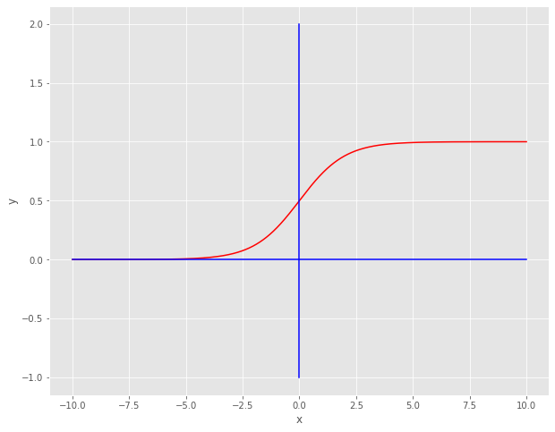
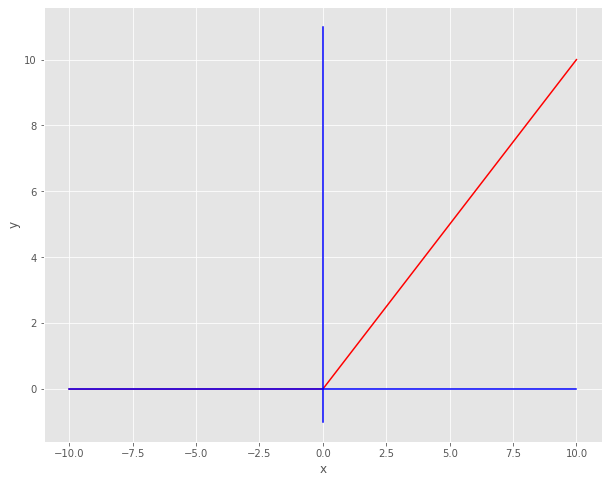
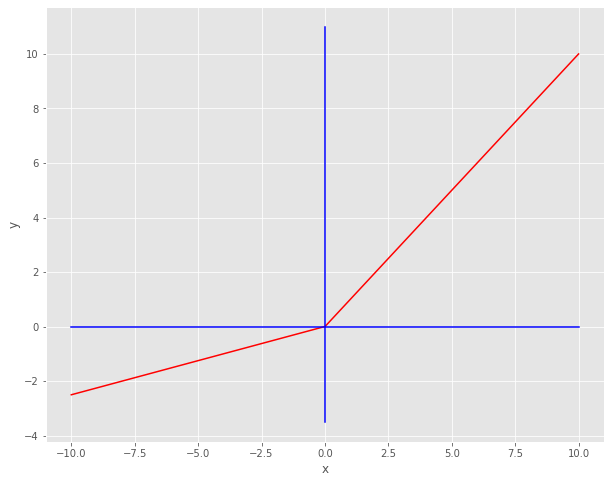
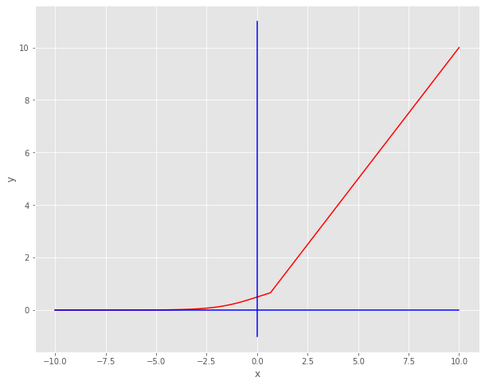
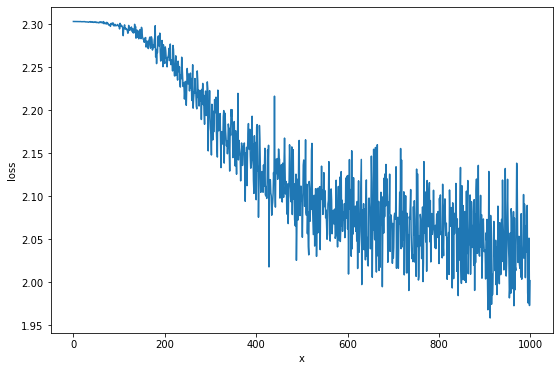

# 激励函数

## 为什么需要激励函数？

因为在现实中，有很多的数据都不是可以使用一个线或者一个平面进行分割的，而根据维基
百科的定义，线性函数是指：线性函数是只拥有一个参数的一阶多项式函数。所以需要引进
非线性函数用来解决线性函数的不足。这种位于层中的非线性函数被称为激励函数。

从另一个角度，如果没有激励函数，那该网络仅仅能表达线性处理，这样即使具有更多的隐
藏层，其功能都可以用单层的神经网络进行实现，表明，如果没有激励函数为模型提供非线
性转化，那隐藏层是没有作用的。

激励函数与损失函数：激励函数用于提供非线性功能，而损失函数用于计算预测结果与实际
结果之间的差异。

激励函数作为一个神经元，用于对输入变量进行处理，事实上任何数学函数都可以作为激励函数。
常见的激活函数有以下几个：

## Sigmoid

非线性函数，取值范围为\[0, 1\], $\sigma(x) = \frac{1}{1 + exp(-x)}$
主要将一个值
归一化，即压缩到0与1之间，根据公式可以看出，大的负数值将会被求值为0，而大的正数
值将会被求值为1。

``` {.python session="py" results="output graphic" file="./images/cifar-on-ann-393527.png" exports="both"}
f_sigmoid = lambda x: 1.0 / (1.0 + np.exp(-x))
def f_plot(f, x):
    y = list(map(f, x))
    plt.style.use('ggplot')
    plt.plot(x, y, 'r-')
    plt.plot([0.0, 0.0], [min(y) -1, max(y)+1], 'b-')
    plt.plot([-10.0, 10.0], [0.0, 0.0], 'b-')
    plt.xlabel('x')
    plt.ylabel('y')

x = np.arange(-10, 10, 0.001)
f_plot(f_sigmoid, x)
```



### 缺点：

在 sigmoid
的两端即位于0或者1上的点的梯度都是0(也称为：饱和)，如果一开始所给予过大
的权重，将会直接被判断为1，将不会被学习。函数输出的结果不是以0为中心化的，而且都
是为大于0。

### 函数

```python
def sigmoid_forward(x):
    out = 1.0 / (1.0 + np.exp(-x))
    cache = (x)
    return out, cache

def sigmoid_backward(dout, cache):
    x = cache
    dx = dout * (np.exp(-x) / (1 + np.exp(-x)) ** 2)
    return dx
```

## tanh

非线性函数，取值范围为\[-1, 1\]，Sigmod变体，但是为0中心化的，$tanh(x) =
2\sigma(2x) - 1$

``` {.python session="py" results="output graphic" file="./images/cifar-on-ann-891349.png" exports="both"}
f_tanh = lambda x: 2.0 * f_sigmoid(2.0 * x) - 1.0
f_plot(f_tanh, x)
```


### 函数

```python
def tanh_forward(x):
    out, _ = sigmoid_forward(2.0 * x)
    out = 2.0 * out - 1.0
    return out, x

def tanh_backward(dout, cache):
    x = cache
    dx = 2.0 * sigmoid_backward(dout, 2.0 * x)
    return dx
```

## 修正线性单元(ReLU)

ReLU(Rectified Linear
Unit)函数表示成$ReLU(x) = max(0, x)$。从斜率的角度看就是，
当x大于0,斜率为1,否则为0。因为ReLU的缺点，所以在使用时，需要小心模型学习速率，如
果很关心学习的速率，可以尝试Leaky ReLU或者Maxout。

``` {.python session="py" results="output graphic" file="./images/cifar-on-ann-723822.png" exports="both"}
f_relu = lambda x: x if x > 0 else 0
f_plot(f_relu, x)
```



### 优点：

在随机梯度下降中，比tanh/Sigmod的收敛速度更快，并由于其是线性的，不会出现饱和现
象(指当达到一定的阀值后，值不会发生改变，如Sigmod中的，当达到一定程度后，很大的
数求值为1,很小的数求值为0，位于两点的梯度都为0，造成梯度消失(kill
gradient)。与
tanh/Sigmod相比，计算量更小，只需要判断，而tanh/Sigmod需要计算指数。

### 缺点：

ReLU很脆弱，如果当具有一个很大的梯度通过一个ReLU神经元时，将会导致这个神经元"死
掉"。这是因为大的梯度，导致权重更新的步伐过快，将可能导致可以通过调整更低的学习速率进行解决。

### 函数

```python
def relu_forward(x):
    out = np.maximum(0, x)
    return out, x

def relu_backward(dout, cache):
    x = cache
    dx = dout
    dx[x < 0] = 0
    return dx
```

## 泄漏ReLU(leaky ReLU)

为了解决ReLU"死掉"问题而设计，当 x\<0
时，将给予一个微小的数，而不是0。就如，当 $x<0 f(x) = ax$ 当
$x>=0 f(x)=x$, 其中a代表一个常数，在一些方面可以取得很好
的结果，但一些方面结果并不令人满意。

``` {.python session="py" results="output graphic" file="./images/cifar-on-ann-495479.png" exports="both"}
f_leaky_relu = lambda x: x if x >= 0 else 0.25*x
f_plot(f_leaky_relu, x)
```



### 函数

```python
def leaky_relu_forward(x):
    out = np.where(x < 0, 0.25*x, x)
    return out, x

def leaky_relu_backward(dout, cache):
    x = cache
    dx = dout
    dx[x < 0] *= 0.25
    return dx
```

## Maxout

将多个激励函数进行合并，表达式为: $max(F_1, F_2, ...)$
，当后面的$F_2, ...,
F_n$为0时退化为ReLU函数，防止梯度消失(饱和)，
有避免ReLu的缺点(因为梯度过大导致
神经元"死掉")，但这样，其对于每一个神经元必须需要传递两个参数以上的变量。

``` {.python session="py" results="output graphic" file="./images/cifar-on-ann-890421.png" exports="both"}
f_maxout = lambda x: f_sigmoid(x) if f_sigmoid(x) > f_relu(x) else f_relu(x)
f_plot(f_maxout, x)
```



# 前向传播

前向传播就是平时看到的传播模式，就是一个一个接着往下传播。简单的前向传播实现，主
要用于理解前向传播的思想。神经网络中的 `channel`
是指每一个样本中的第三维度，就 图片来说，一般具有 `RGB`
三层。而 `depth` 是指隐藏层的个数，一般也称为内核个数。

添加 `zero padding`
是为了保持输出的采集结果维度与原来的相同。

采集结果的矩阵的维度计算：

-   $height = (X_{height} - W_{height} + 2 * ZeroPadding) // stride + 1$
-   $wight = (X_{width} - W_{width} + 2 * ZeroPadding)$

`np.pad()` 对一个矩阵进行填补。

## 卷积前向传播算法

这个简单的算法使用的仅仅是线性组合。$f(x_i, W, b) = W x_i + b$

```python
def forward_pass(input_volumes, input_weights, input_biases, stride=1, zero_padding=0):
    '''
    Inputs:
    ------------------------------------------------------------
    - input_volumns: the train dataset. (N, channel, width, height)
    - input_weights: the weights array. (K, channel, widht, height)
    - input_biase:   the biases. (K, )
    - zero_padding:  the size of padding for zero.
    Outputs:
    ------------------------------------------------------------
    - dout: The weights array collection result. (N, K, o_height, o_width)
    - cache: The parameters cache. (dict)
    '''
    x_num, x_channel, x_height, x_width = input_volumes.shape
    w_num, _, w_height, w_width = input_weights.shape
    o_height = (x_height - w_height + 2*zero_padding) // stride + 1
    o_width = (x_width - w_width + 2*zero_padding) // stride + 1

    X = np.pad(input_volumes, ((0, 0), (0, 0), (zero_padding, zero_padding), (zero_padding, zero_padding)),
               "constant", constant_values=0)

    # 每一个采集器只会产生一个二维的数组
    dout = np.zeros((x_num, w_num, o_height, o_width))
    # 对样本迭代，即对每一张图片进行迭代
    for n in range(x_num):
        # 对多个采集器进行迭代采集
        for k in range(w_num):
            for y in range(0, o_height):
                for x in range(0, o_width):
                    # 利用输出的维度，反推采集的区域
                    dout[n, k, y, x] = np.sum(
                        X[n, :, y*stride:y*stride + w_height, x*stride:x*stride + w_width] * input_weights[k]
                    ) + input_biases[k]
    cache = (input_volumes, input_weights, input_biases, stride, zero_padding)
    return dout, cache
```

## 测试数据

```python
x_shape = (2, 3, 4, 4)
w_shape = (3, 3, 4, 4)
x = np.linspace(-0.1, 0.5, num=np.prod(x_shape)).reshape(x_shape)
w = np.linspace(-0.2, 0.3, num=np.prod(w_shape)).reshape(w_shape)
b = np.linspace(-0.1, 0.2, num=3)

# 正确的答案
correct_out = np.array([[[[-0.08759809, -0.10987781],
                          [-0.18387192, -0.2109216 ]],
                         [[ 0.21027089,  0.21661097],
                          [ 0.22847626,  0.23004637]],
                         [[ 0.50813986,  0.54309974],
                          [ 0.64082444,  0.67101435]]],
                        [[[-0.98053589, -1.03143541],
                          [-1.19128892, -1.24695841]],
                         [[ 0.69108355,  0.66880383],
                          [ 0.59480972,  0.56776003]],
                         [[ 2.36270298,  2.36904306],
                          [ 2.38090835,  2.38247847]]]])
# 计算相对误差
dout, _ = forward_pass(x, w, b, 2, 1)
print("relative_error: ", relative_error(dout, correct_out))
```

``` {.example}
relative_error:  2.2121476417505994e-08
```

# 通过卷积处理图片

读取图片，在原来的 `scipy` 包中，可以使用
`scipy.misc.imread` 来对图片进行读取， 而后来的
`scipy` 包中可以使用 `scipy.imageio.imread`
来取代，但是 `scipy.imageio.imread` 返回的数组类型是
`scipy.imageio.core.util.Array` ，而不是 常用的
`numpy.ndarray` 数组，因此可以使用
`matplotlib.pyplot.imread` 对图片进行读取并返 回
`numpy.ndarray` 格式。但是最新的 `scipy`
版本中，也没有了 `imageio` 模块；而
`matplotlib.pyplot.imread` 支持的格式并不是很多，需要可以使用
`pillow` 。

## 图片预览

``` {.python session="py" results="output graphic" file="./images/cifar-on-ann-834866.png" exports="both"}
from PIL import Image
kieen = Image.open("./images/cifar-on-ann-cat.jpg")
# kieen = plt.imread("./images/cifar-on-ann-cat.jpg")
puppy = Image.open("./images/cifar-on-ann-dog.jpg")
plt.figure(figsize=(10.0, 8.0))
plt.subplot(1, 2, 1)
plt.imshow(kieen)
plt.xticks([])
plt.yticks([])
plt.subplot(1, 2, 2)
plt.imshow(puppy)
plt.xticks([])
plt.yticks([])
plt.show()
```


## 裁剪

由于图片分辨率为1277x1920不是方阵，这里先对图片进行裁剪成方阵。

``` {.python session="py" results="output graphic" file="./images/cifar-on-ann-689444.png" exports="both"}
kieen_cropped = kieen.crop((0, 0, kieen.size[0], kieen.size[0]))
puppy_cropped = puppy.crop((0, 0, puppy.size[0], puppy.size[0]))
plt.subplot(1, 2, 1)
plt.imshow(kieen_cropped)
plt.axis('off')
plt.subplot(1, 2, 2)
plt.imshow(puppy_cropped)
plt.axis('off')
```


## 重设大小

选择一个更小的图片进行试验。

```python
img_size = 200
kieen_small = kieen.resize((img_size, img_size))
puppy_small = puppy.resize((img_size, img_size))
kieen_array = np.array(kieen_small)
puppy_array = np.array(puppy_small)

x = np.zeros((2, 3, img_size, img_size))
# 将RGB维放在前面
x[0, :, :, :] = kieen_array.transpose((2, 0, 1))
x[1, :, :, :] = puppy_array.transpose((2, 0, 1))
```

## 生成权重矩阵（过滤器）

```python
# 一共两个过滤器，每一个为3x3x3
w = np.zeros((2, 3, 3, 3))

# 第一个，利用矩阵对图片进行转变
w[0, 0, :, :] = [[0, 0, 0], [0, 0.3, 0], [0, 0, 0]] # red
w[0, 1, :, :] = [[0, 0, 0], [0, 0.6, 0], [0, 0, 0]] # green
w[0, 2, :, :] = [[0, 0, 0], [0, 0.1, 0], [0, 0, 0]] # blue

w[1, 2, :, :] = [[1, 2, 1], [0, 0, 0], [-1, -2, -1]] # blue
# 偏差
b = np.array([0, 128])
```

## 卷积操作

``` {.python session="py" results="output graphic" file="./images/cifar-on-ann-321220.png" exports="both"}
out, _ = forward_pass(x, w, b, 1, 1)

def imshow_helper(img, normalize=True):
    '''predigest the plot command'''
    # 归一化
    if normalize:
        img_max, img_min = np.max(img), np.min(img)
        img = 225.0 * (img - img_min) / (img_max - img_min)
    plt.imshow(img.astype('uint8'))
    plt.gca().axis('off')

plt.figure(figsize=(15, 10))
# kieen
plt.subplot(2, 4, 1)
imshow_helper(kieen_array, normalize=False)
plt.title('original')
plt.subplot(2, 4, 2)
imshow_helper(kieen_array, normalize=True)
plt.title('normalize')
plt.subplot(2, 4, 3)
imshow_helper(out[0, 0])
plt.title('grayscale')
plt.subplot(2, 4, 4)
imshow_helper(out[0, 1])
plt.title('edges')

# puppy
plt.subplot(2, 4, 5)
imshow_helper(puppy_array, normalize=False)
plt.subplot(2, 4, 6)
imshow_helper(puppy_array, normalize=True)
plt.subplot(2, 4, 7)
imshow_helper(out[1, 0])
plt.subplot(2, 4, 8)
imshow_helper(out[1, 1])
plt.show()
```


# 两层神经网络

`input -> fully connected layer -> ReLU(no linear) -> fully connected
layer(class scores) -> softmax(loss function).`

通过线性（全连接层）计算出来的得分，经过处理（分类中，寻找最大的得分的类作为预测
结果）后，将所预测的结果与实际的目标进行比较，如果差异很小，则代表当前的参数很好。
(我们希望预测结果与目标接近，即差异越小效果越优)。而如果差异很大，则我们想将该信
息传递给前面的权重参数（比如，当前差异很大，希望减少权重），这就是反向传播的原理。
而在传播过程前，我们需要将"很大差异"转便成可以接受的数值。这就是损失函数的工作。

其应该具有几个要求：

-   可以通过求导知道权重更新的方向(可导)
-   如果当前"差异"很小，应当保持前面的权重不变。

在下面的例子中使用的损失函数是 `Softmax` 函数。$L_i =
-log(\frac{f_{y_j}}{\sum_j e^{f_j}})$，
其中$f_{y_i}$代表着目前的正确类的 `scores` 。

## 模型

```python
class TwoLayerNN(object):
    def __init__(self, input_size, hidden_size, output_size, std=1e-4):
        '''
        Inputs:
        ------------------------------------------------------------
        - input_size: The input dataset every sample dimension muliplay.
        - hidden_size: The neurons of H in the hidden layers.
        - output_size: The numbers of classes.
        - std: The standard variable.
        Outputs:
        ------------------------------------------------------------
        - self.params: (dict) store the parameters of weights, bias.
        '''
        self.params = {}
        self.params['W1'] = std * np.random.randn(input_size, hidden_size)
        self.params['B1'] = np.zeros(hidden_size)
        self.params['W2'] = std * np.random.randn(hidden_size, output_size)
        self.params['B2'] = np.zeros(output_size)

    def loss(self, x, y=None, reg=0.0):
        '''
        Use softmax compute loss
        Inputs:
        ------------------------------------------------------------
        - x: The x is the need computer loss value data set..
        - y: The y is labels parallelism of x.
        - reg: The lambda of reguarization.
        Outpus:
        ------------------------------------------------------------
        - loss: The loss about softmax data loss and regularization loss.
        '''
        W1, B1 = self.params['W1'], self.params['B1']
        W2, B2 = self.params['W2'], self.params['B2']
        N, D = x.shape

        # input -> [fc -> relu] -> fc
        H1 = np.maximum(0, np.dot(x, W1) + B1)
        # input -> fc -> relu -> [fc]
        scores = np.dot(H1, W2) + B2
        if y is None:
            return scores

        scores -= scores.max()
        exp_scores = np.exp(scores)
        sum_exp_scores = np.sum(exp_scores, axis=1)
        corr_exp_scores = exp_scores[range(N), y]
        data_loss = (-1) * np.log(corr_exp_scores / sum_exp_scores)
        reg_loss = reg * (np.sum(W1 * W1) + np.sum(W2 * W2))
        loss = np.sum(data_loss) / N + reg_loss

        grads = {}              # # backpass gradient
        d_scores = exp_scores / sum_exp_scores.reshape(N, 1)
        d_scores[range(N), y] = - (sum_exp_scores - corr_exp_scores) / sum_exp_scores
        d_scores /= N
        d_H1 = d_scores.dot(W2.T)
        d_H1[H1 == 0] = 0
        d_W2 = H1.T.dot(d_scores)
        d_B2 = d_scores.sum(axis=0)
        d_W1 = x.T.dot(d_H1)
        d_B1 = d_H1.sum(axis=0)

        grads['W1'] = d_W1 + reg * W1 * 2
        grads['W2'] = d_W2 + reg * W2 * 2
        grads['B1'] = d_B1
        grads['B2'] = d_B2
        return loss, grads

    def train(self, X, y, X_val, y_val, learning_rate=1e-3, learning_rate_decay=0.95,
              reg=5e-6, num_iters=100, batch_size=200, verbose=False):
        '''
        Inputs:
        ------------------------------------------------------------
        - X: The train data set. (N, D)
        - y: The train data labels. (N, )
        - X_val: The validation data set. (N_val, D).
        - y_val: The validation data labels. (N_val, )
        - learning_rate: The weight update learning step.
        - learning_rate_decay: The parameters used to decay the learning rate after each point.
        - reg: The lambda of regularizaion.
        - num_iters: The iter numbers of train.
        - batch_size: Number of sample used each train.
        - verbose: boolean, whether print details information.
        Outputs:
        ------------------------------------------------------------
        '''
        num_train = X.shape[0]
        each_iter_epoch = max(num_train / batch_size, 1)

        loss_history = []
        train_acc_history = []
        val_acc_history = []

        for i in range(num_iters):
            batch_idx = np.random.choice(num_train, batch_size)
            x_batch = X[batch_idx]
            y_batch = y[batch_idx]

            loss, grads = self.loss(x_batch, y_batch, reg=reg)
            loss_history.append(loss)

            self.params['W1'] -= learning_rate * grads['W1']
            self.params['W2'] -= learning_rate * grads['W2']
            self.params['B1'] -= learning_rate * grads['B1']
            self.params['B2'] -= learning_rate * grads['B2']

            if verbose and i % 100 == 0:
                print("inter number: (%d / %d) loss: %f" %(i, num_iters, loss))

            # 寻找最优的学习速率。
            if i % each_iter_epoch == 0:
                train_acc = (self.predict(x_batch) == y_batch).mean()
                val_acc = (self.predict(X_val) == y_val).mean()
                train_acc_history.append(train_acc)
                val_acc_history.append(val_acc)

                learning_rate *= learning_rate_decay

        return {
            "loss_history": loss_history,
            "train_acc_history": train_acc_history,
            "val_acc_history": val_acc_history
        }

    def predict(self, x):
        y_pred = np.argmax(np.dot(np.maximum(0, np.dot(x, self.params['W1']) + self.params['B1']),
                                  self.params['W2'])
                           + self.params['B2'], axis=1)
        return y_pred
```

## 测试

```python
input_size = 4                  # 单个样本的维度
output_size = 3                 # 输出的类个数
hidden_size = 10                # 隐藏层中节点个数
num_input = 5                   # 样本个数

def init_twolayer():
    np.random.seed(0)
    return TwoLayerNN(input_size, hidden_size, output_size, std=1e-1)

def init_data():
    np.random.seed(1)
    x = 10 * np.random.randn(num_input, input_size)
    y = np.array([0, 1, 2, 2, 1])
    return x, y

net = init_twolayer()
net_x, net_y = init_data()
net_loss, _ = net.loss(net_x, net_y, reg=0.05)
abs(net_loss - float(1.30378789133))
```

# 训练模型

```python
cifar_net = TwoLayerNN(X_train2d.shape[1], 50, 10)
cifar_stats = cifar_net.train(X_train2d, Y_train, X_vali2d, Y_vali,
                              learning_rate=1e-4, learning_rate_decay=0.95,
                              reg=0.25, num_iters=1000, batch_size=200, verbose=False)
```

查看模型的准确率。

```python
print("val accurary: %f" %((cifar_net.predict(X_vali2d) == Y_vali).mean()))
```

``` {.example}
val accurary: 0.248000
```

# 调整参数

通过前面的训练过程中，我们记录了 `loss_history, train_acc_history,
val_acc_history` 加上从模型的对象中可以获得模型的权重信息。

``` {.python session="py" results="output graphic" file="./images/cifar-on-ann-602007.png" exports="both"}
plt.figure(figsize=(9.0, 6.0))
plt.plot(cifar_stats['loss_history'])
plt.xlabel('x')
plt.ylabel('loss')
```


从上图中，看出损失函数是来回波动下降的，而导致波动的原因可能是学习速率太快。

将前面训练的过程结合起来，根据输出结果进行调整参数，寻找最高的准确率。

```python
hidden_size = list(range(100, 1000, 100))
learning_rate = [1e-3, 1e-4, 1e-5, 2e-3, 2e-4, 2e-5, 3e-3, 3e-4, 3e-5]
reg = np.arange(0, 1, 0.2)

cifar_model = None
cifar_model_acc = 0
for h in hidden_size:
    for l in learning_rate:
        for r in reg:
            net = TwoLayerNN(X_train2d.shape[1], h, 10)
            net_stats = net.train(X_train2d, Y_train, X_vali2d, Y_vali,
                                   learning_rate=l, learning_rate_decay=0.95,
                                   reg=r, num_iters=1000, batch_size=200, verbose=False)
            acc = net_stats['val_acc_history'][-1] # the last validation accurary.
            if acc > cifar_model_acc:
                cifar_model = net
                cifar_model_acc = acc
            print("h: %d, l: %f, r: %f, acc: %f" %(h, l, r, acc, ))
```

```python
print("The best accurary: %f" %cifar_model_acc)

y_pred = cifar_model.predict(X_test2d)
print("Test acc: %f" %(np.mean(y_pred == Y_test)))
```

``` {.example}
The best accurary: 0.421000
Test acc: 0.389000
```

# 总结

1.  神经网络的建模流程是：通过通过前向传播计算最后的得分(scores)，根据损失函数、
    得分、真实值计算损失值；根据损失函数的可导性质，计算处于当前输入值(inputs)的
    梯度，在根据梯度的方向，方向更新权重，以至于损失值达到最小。
2.  调整参数的流程：提前设定好需要迭代的参数(隐藏层、学习速率、正则参数)，计算模
    型在各个参数下的准确率，寻找最高准确率的模型。

# 参考

1.  [CS231N](http://cs231n.github.io/)
