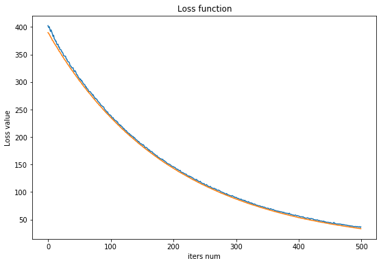

由于 KNN
每一次分类预测都使用到所有的数据样本，导致计算量很大，不利于模型的快速
部署。在实际应用中，我们希望用户直接输入需要预测的数据，而可以马上输出结果，而不
用重新训练模型。所以，我们需要保留训练过的模型，而可以完全丢弃训练过的数据。

一个线性分类器具有两个部分：

-   scores function(得分函数)，从原始数据计算各个类的得分。
-   loss function(损失函数)，表示预测值与真实值之间的得分差距。

# scores

权重，在网络中看，就是两两节点之间的连接线，其大小代表着线的粗细，表示着两个点之
间的关系。而一个节点的得分(scores)等于前一层的节点的加权和。

## 线性组合得分

``` {.python session="py" results="output silent" exports="both"}
def forward_scores(x, w, b):
    x = x.reshape(x.shape[0], -1)
    scores = x.dot(w) + b
    cache = (x, w, b)
    return scores, cache
```

## 反向传播

``` {.python session="py" results="output silent" exports="both"}
def backward_scores(dscores, cache):
    x, w, b = cache
    dx = dscores.dot(w.T)
    dw = x.T.dot(dscores)
    db = np.sum(dscores, axis=0)
    return dx, dw, db
```

# loss functions

对于一个分类问题，可以计算出正确类与预测类之间的得分(scores)差距。作为一个学习的
过程，我们希望模型前面的权重可以根据得分差距进行调整，经过调整后的权重值，可以使
得模型的损失值更小。

## 多分类支持向量机(MSVM)

多分类支持向量机从二分类扩展而来，属于监督学习方法中的一种，经过改进，也可以使用
在无监督学习中(支持向量机聚类)。

### 原理

$L_i = \sum_{j \neq y_i} \max(0, s_j - s_{y-j} + \delta) $
其中$i$代表第$i$
个样本，$j$表示成当前样本所需要预测的类个数，$y_j$代表正确类的得分，根据上面
的公式来看，Supports Vector Machine
的原理在于计算当前样本属于每一个类的得分，然
后通过将其他不正确类的得分减去正确类的得分后加上偏差的总和。

### 算法实现

`np.reshape(a, newshape`-1)=
其中-1代表根据给出的值，推断出后面的值。下面函数用
来计算数据损失部分。整个 `SVM`
计算出来的损失函数值，并计算梯度。

``` {.python session="py" results="output silent" exports="both"}
def svm_loss(scores, y, delta=1):
    N = scores.shape[0]
    correct_class_scores = scores[list(range(N)), y].reshape(N, -1)
    margins = scores - correct_class_scores + delta
    margins[list(range(N)), y] = 0
    loss = np.sum(np.maximum(margins, 0)) / N

    dscores = np.zeros(scores.shape)
    # if margins > 0, the \frac{d L_i}{d y_j} = 1
    dscores[margins > 0] = 1
    # if margins > 0, the \frac{d L_i}{d y_i} = \sum -1
    dscores[list(range(N)), y] -= np.sum(margins > 0, axis=1)
    dscores /= N
    return loss, dscores
```

## Softmax classifier

对数Softmax
函数为二项分布Logistic回归的推广，使用于多分类，当仅仅有两个类时，退化为
Logistic回归。Logistic输出的结果是两个分类的对数发生比。

Softmax classifier
结合交互熵(cross-entropy)和Softmax函数。根据定义softmax的定义 应该为
$S_i = \frac{ e^{f_{y_i}} }{ \sum_k e^{f_{y_k}}}$, 而在加上交互熵$C
= - \sum_i y_i log scores_i$，
$y_i$表示当前正确的类。$f_{y_i}$表示正确类的 得分。当前正确的类表示为1,
否则为0。

对Softmax
classifier求导的过程中，可以分情况求导$\frac{d L_i}{d score_j}$，一
种情况为: $i = j$，还有一种情况是：$i \neq j$，再进行合并。

由于$e^{f_{y_i}}$会导致很大的数，从而使得计算机在计算时不稳定，所以我们需要对
其进行正规化，对$S_i$方程上下同乘一个常数$C$，C为任意参数，普遍的选择$C =
-max_j f_j$，使得最大的得分为0。

``` {.python session="py" results="output silent" exports="both"}
def softmax_loss(scores, Y):
    N = scores.shape[0]
    scores -= np.max(scores, axis=1, keepdims=True)
    exp_scores_sum = np.sum(np.exp(scores), axis=1, keepdims=True)

    # np.log(np.exp(scores) / exp_scores_sum)
    log_probs = scores - np.log(exp_scores_sum)
    loss = -np.sum(log_probs[list(range(N)), Y]) / N

    probs = np.exp(log_probs)
    dscores = probs.copy()
    # if i = j, \frac{d L_i}{d e^{scores_i}} = 0
    # because the max value is become 0, then exp(0) = 1
    # if i != j, will equal itself.
    dscores[list(range(N)), Y] -= 1
    dscores /= N

    return loss, dscores
```

# 线性分类器

``` {.python session="py" results="output silent" exports="both"}
class LinerClassifier():
    def __init__(self):
        self.W = None
        self.b = None

    def train(self, X, Y, class_num, learning_rate=1e-3, regularization=1e-5, num_iters=100,
              batch_size=128, verbose=False):
        '''
        Inputs:
        ------------------------------------------------------------
        - X: (N, D) train set.
        - Y: (N, 1) label set.
        - learning_rate: (float) SGD learning rate.
        - regularization: (float) regularization lambda.
        - num_iters: (integer) SGD iters num.
        - batch_size: (integer) SGD splits each batch size.
        - verbose: (boolen) whether print details infomations.
        Outputs:
        ------------------------------------------------------------
        - loss_history: (list).
        '''
        x_num, x_dim = X.shape
        if self.W is None:
            self.W = 0.001 * np.random.randn(x_dim, class_num)
        if self.b is None:
            self.b = np.zeros(class_num)

        loss_history = []
        for i in range(num_iters):
            batch_idx = np.random.choice(x_num, batch_size)
            X_batch = X[batch_idx]
            Y_batch = Y[batch_idx]

            scores, cache = forward_scores(X_batch, self.W, self.b)
            data_loss, dscores = self.loss(scores, Y_batch)
            loss = data_loss + 0.5 * regularization * np.sum(self.W ** 2)

            _, dw, db = backward_scores(dscores, cache)
            dw += regularization * self.W

            loss_history.append(loss)

            self.W += (-1) * learning_rate * dw
            self.b += (-1) * learning_rate * db

            if verbose:
                print('Current iters informarion count: %s  loss: %s' %(i, loss))
        return loss_history

    def loss(self, scores, y):
        pass

    def predict(self, X):
        '''
        Inputs:
        ------------------------------------------------------------
        - X: (N, D) is the test set.
        Outputs:
        ------------------------------------------------------------
        - pred: (N, 1) is the predict label.
        '''
        pred = np.zeros(X.shape[0])
        scores = X.dot(self.W)
        pred = np.argmax(scores, axis=1)
        return pred

class LinerSVM(LinerClassifier):
    def loss(self, scores, y):
        return svm_loss(scores, y)

class LinerSoftmax(LinerClassifier):
    def loss(self, scores, y):
        return softmax_loss(scores, y)
```

# 测试数据

``` {.python session="py" results="output" exports="both"}
# 将数据添加一组偏差
X_train2d_dev = np.hstack([X_train2d, np.ones((X_train2d.shape[0], 1))])
X_test2d_dev = np.hstack([X_test2d, np.ones((X_test2d.shape[0], 1))])

svm = LinerSVM()
# train return loss_history
loss_hist = svm.train(X_train2d_dev, Y_train, class_num=10, learning_rate=1e-7, regularization=2.5e4,
                      num_iters=500, verbose=False)
ypred = svm.predict(X_test2d_dev)
svm_acc = np.mean(ypred == Y_test)

softmax = LinerSoftmax()
softmax_loss_history = softmax.train(X_train2d_dev, Y_train, class_num=10, learning_rate=1e-7, regularization=2.5e4,
                                 num_iters=500, verbose=False)
softmax_ypred = softmax.predict(X_test2d_dev)
softmax_acc = np.mean(softmax_ypred == Y_test)
print("svm accurary: %.2f, softmax accurary: %.2f" %(svm_acc, softmax_acc))
```

``` {.example}
svm accurary: 0.33, softmax accurary: 0.26
```

# 损失函数可视化

``` {.python session="py" results="output graphic" file="./images/cifar-on-linear-classficier-918772.png" exports="both"}
plt.figure(figsize=(9.0, 6.0))
plt.plot(loss_hist)
plt.plot(softmax_loss_history)
plt.title('Loss function')
plt.ylabel('Loss value')
plt.xlabel('iters num')
plt.show()
```



# reference

1.  [CS231N linear
    classifier](https://cs231n.github.io/linear-classify/)
2.  [wiki supports vectors
    machine](https://zh.wikipedia.org/wiki/%E6%94%AF%E6%8C%81%E5%90%91%E9%87%8F%E6%9C%BA)
