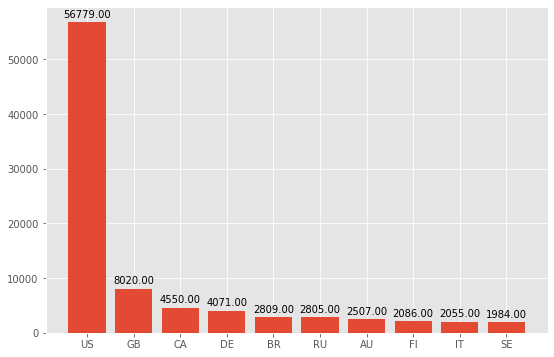
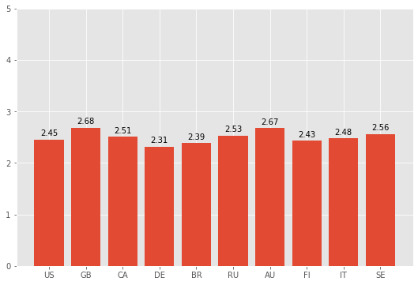
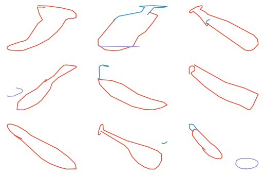
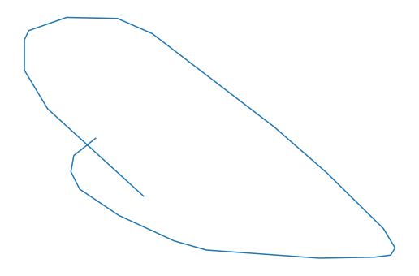

# 整体概要

-   目标：
    -   使用AI生成具有手写风格的图片。
    -   可以将人们手写图片的风格记录下来，用来生成一些独特的图片。
-   思路：
    -   使用QuickDraw的数据训练模型。
    -   对神经网络具有更加深入的了解。

# 依赖加载

```python
import numpy as np
import pandas as pd
import matplotlib.pyplot as plt
from matplotlib.animation import FuncAnimation

import ndjson                   # 解析ndjson文件
import json
```

# 加载数据

先尝试使用baseball~bat数据集~，后面可以只需改变数据集就可以了。

```python
with open("/home/luhuaei/Data/google-quickdarw/baseball_bat.ndjson", 'r') as f:
    # pandas provice many utils function
    DATA_BASEBALL = pd.DataFrame(ndjson.load(f))
    DATA_BASEBALL.drawing = DATA_BASEBALL.drawing.apply(lambda x: np.array(x))
```

# 实用函数

这里定义一些经常调用的函数。

```python
def bar_annotate(draw_rect):
    for rect in draw_rect:
        height = rect.get_height()
        # textcoords is determine the annotate text coords, here `offset points' is represented
        # offset points from xy values.
        ax.annotate('%.2f' %(height, ), xy=(rect.get_x() + rect.get_width() / 2, height),
                    xytext=(0, 3), textcoords='offset points', ha='center', va='bottom')
```

# 描述信息

描述分析，好像我也经习惯了，每拿到一个数据，首先进行描述分析，当我看别人做的分析
报告时，才发现简单的描述分析对于了解整个数据集还是不够的。

## baseball~bat~

```python
count_country = DATA_BASEBALL.countrycode.value_counts()

plt.style.use('ggplot')
fig, ax = plt.subplots(figsize=(9.0, 6.0))
rect = ax.bar(count_country[:10].index, count_country[:10].values)
bar_annotate(rect)
```



从上面的图中可以了解到，在Google平台上进行QuickDraw的用户中，属于US的占最多，其
中属于baseball~bat这一项目中就具有56779个用户~。可能的原因是：Google建立于美国
本地，用户量大。

```python
DATA_BASEBALL['count_strokes'] = DATA_BASEBALL.drawing.apply(lambda x: np.array(x).shape[0])

mean_strokes = DATA_BASEBALL.count_strokes.groupby(DATA_BASEBALL.countrycode).mean()
fig, ax = plt.subplots(figsize=(9.0, 6.0))
bar = ax.bar(count_country[:10].index, mean_strokes[count_country[:10].index])
bar_annotate(bar)
ax.set_ylim(0, 5)
```



从上面的图中，在参与人数最多前10的国家中，每一个国家的描绘一个baseball~bat的平均~
笔划都是集中在2.0附近。其中最高的是GB(Great
Britain)，最低的是DE(Germany).

```python
fig, ax = plt.subplots(3, 3, figsize=(9.0, 6.0))
index = np.random.choice(DATA_BASEBALL.index, 9)
for i, a in zip(index, ax.flatten()):
    drawing = DATA_BASEBALL.drawing[i]
    for draw_line in drawing:
        a.plot(draw_line[0], draw_line[1], '-')
        a.set_axis_off()
```



生成一个动态的gif图，快速浏览100张图片的形状。

```python
fig, ax = plt.subplots(figsize=(9.0, 6.0))
index = np.random.choice(DATA_BASEBALL.index, 100)
def gif_update(iter_count):
    drawing = DATA_BASEBALL.drawing[iter_count]
    ax.clear()
    for draw_line in drawing:
        ax.plot(draw_line[0], draw_line[1])
        ax.set_axis_off()
anim = FuncAnimation(fig, gif_update, frames=index, interval=5000)
anim.save(path, fps=60, writer='imagemagick')
```



# 切割数据

```python
```
