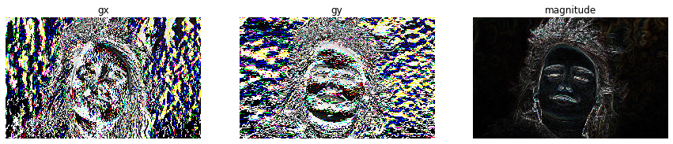

> Q: How do you eat an elephant? A: One bite at a time.

先从图片中提取特征，再根据这些特征用线性分类器进行分类。从前面的文章中，我们可以
知道使用 `SVM`{.verbatim} 对图片进行分类，准确率仅仅35%。

在深度学习还没有发展起来的时候，人们使用图像识别的主要途径(pipeline):

-   input images
-   preprocess. e.g(resize, normalize)
-   extract features. e.g(HOG(histogram of oriented gradient),
    HAAR(haar-like features, 哈尔特征), SIFT(scale invariant features
    transforms descriptor，尺度不变特征变换), SURF(Speed Up Robust
    Feature、加速稳健特征)
-   algorithm learning. e.g(Supports Vectors Machine, Random Forests,
    ANN)
-   prediction labels.

可见、对于图片识别的传统建模流程与对一些数据进行分析的流程是类似的。

# HOG(histogram of oriented gradient, 方向梯度直方图)

> HOG should capture the texture of the images while ignoring color
> information.

从上面这个通俗的解释上看，HOG是在忽略图片的颜色，而仅仅提取图片的纹理。可以纹理
在图片中就是依靠不同颜色而表现出来的？忽略颜色还怎么提取纹理？一些模型的提取纹理
就是从区域中比较两元素单元的颜色差。

因为对于一张灰色度的图片来说，其也是没有颜色的，但我们可以分辨出灰色度的图片，原
因在于，虽然没有颜色，但是每一个元素的亮度不一样。所以如果两个元素之间的亮度差比
较大，将被视为一个纹理。

根据[维基百科](https://zh.wikipedia.org/wiki/%E6%96%B9%E5%90%91%E6%A2%AF%E5%BA%A6%E7%9B%B4%E6%96%B9%E5%9B%BE)上，描述HOG的具体实现方法是：将图像分割成小的连通区域(细胞单元)、采
集细胞单元中各个像素点的梯度或者边缘的方向直方图。最后将这些直方图组合起来就可以
构成特征采集器(descriptor)。

一个采集器，就是从一个 `width x height x channel`{.verbatim}
的图片中，输出一个长度为 `n`{.verbatim} 的向量或者数据，
`HOG`{.verbatim} 采集的结果维度并不是固定不变的。

至于那一种特征(feature)的"有用的"，这个根据不同的目的具有不同的选择。

> 如在辨别一个圆形按钮和方形按钮时，边缘(edges)特征将是有用的，而颜色是没有用的。

而在 `H(histogram) O(oriented) G(gradient)`{.verbatim}
采集器中，选梯度(gradients)的方向 (oriented)的分布(distribution,
histogram)作为特征。选择梯度的原因在于，位于边缘
或者角落(密度陡增或者陡降的区域)。而且边缘和角落比起其他区域包含更多关于对象形状
的信息。

## How to calculate HOG?

HOG原始被使用于识别行人(pedestrian
detection)。至于关于预处理，由于预处理的对后
面的结果作用不大，可以跳过。为了方便后面的计算，将图片的高度设为400,(至于图片大
小，并没有限制，只要求高度与宽度成比例1:2)

[图片来源](https://pixabay.com/photos/person-human-female-girl-face-864804/)

```python
female = plt.imread("/home/luhuaei/blog/src/posts/images/images-extract-features-female.jpg")
female = female[:400, :, :]
plt.figure(figsize=(9.0, 6.0))
plt.imshow(female)
plt.axis('off')
```


下面对上面的图片计算梯度。使用 `np.pad()`{.verbatim}
函数对矩阵进行扩充。其中 `((2, 2))`{.verbatim} 参
数表示左上角扩充2行、右下角扩充2行。 `np.pad(np.zeros((2, 2)), ((2, 2)),
mode = 'constant', constant_values = 1)`{.verbatim}
。使用两个卷积核计算对应x和y的梯度。

``` {.python session="py" results="output silent" exports="both"}
kernel_x = np.array([  [+1, 0, -1],
                       [+1, 0, -1],
                       [+1, 0, -1]])
kernel_y = np.array([  [+1, +1, +1],
                       [0, 0, 0],
                       [-1, -1, -1]])
def rgb2gray(image):
      return np.dot(image, [0.299, 0.587, 0.144])
```

``` {.python session="py" results="output silent" exports="both"}
def convolution2d(image, kernel, zero_padding=0, stride=1, grayscale=True, keep_channel=False):
    '''
    image: The array is 3 dimensional.(channel, height, width)
    kernel: The kenels.
    grayscale: bool, represent whether convert RGB to grayscale.
    keep_channel: bool, represent whether keep channel output.(only grayscale is False)
    '''
    if grayscale:
        image = rgb2gray(image.transpose(1, 2, 0))
        image = np.atleast_3d(image).transpose(2, 0, 1)
    elif image.ndim == 2:
        image = np.atleast_3d(image).transpose(2, 0, 1)

    i_channel, i_height, i_width = image.shape
    if not keep_channel:
        i_channel = 1

    k_height, k_width = kernel.shape

    o_width = (i_width - k_width + 2 * zero_padding ) // stride + 1
    o_height = (i_height - k_height + 2 * zero_padding) // stride + 1

    if zero_padding:
        # pad_width: if only one tuple, will execute all axis, if provide three, will control each axis.
        image = np.pad(image, ((0, 0), (zero_padding, zero_padding), (zero_padding, zero_padding)),
                       mode='constant', constant_values=0)
    rest = np.zeros((i_channel, o_height, o_width))

    for o_h in range(o_height):
        for o_w in range(o_width):
            rect = image[:, o_h:(o_h * stride) + k_height, o_w:(o_w * stride) + k_width] * kernel
            if not keep_channel and not grayscale:
                rest[:, o_h, o_w] = np.sum(np.max(rect, axis=0))
            else:
                test = np.sum(rect, axis=(1, 2))
                rest[:, o_h, o_w] = test
    return rest

def computer_oriented(gx, gy):
    return np.arctan2(gy, (gx + 1e-15)) * (180 / np.pi) + 90
```

下面，我们对图片计算卷积后的梯度，灰色度、颜色(但只取最大的channel)，保留三层
channel的。

``` {.python session="py" results="output silent" exports="both"}
female_gx = convolution2d(female.transpose(2, 0, 1), kernel_x)
female_gy = convolution2d(female.transpose(2, 0, 1), kernel_y)
female_gradient = np.sqrt(np.square(female_gx) + np.square(female_gy))
female_oriented = computer_oriented(female_gy, female_gx)

female_gxc = convolution2d(female.transpose(2, 0, 1), kernel_x, grayscale=False)
female_gyc = convolution2d(female.transpose(2, 0, 1), kernel_y, grayscale=False)
female_gradientc = np.sqrt(np.square(female_gxc) + np.square(female_gyc))
female_orientedc = computer_oriented(female_gyc, female_gxc)

female_gxcc = convolution2d(female.transpose(2, 0, 1), kernel_x, grayscale=False, keep_channel=True)
female_gycc = convolution2d(female.transpose(2, 0, 1), kernel_y, grayscale=False, keep_channel=True)
female_gradientcc = np.sqrt(np.square(female_gxcc) + np.square(female_gycc))
female_orientedcc = computer_oriented(female_gycc, female_gxcc)
```

对梯度进行可视化，梯度大的地方代表着亮度越大。

``` {.python session="py" results="output graphic" file="./images/image-extract-features-72804.png" exports="both"}
plt.figure(figsize=(15.0, 10.0))
plt.subplot(1, 3, 1)
plt.imshow(female_gx[0].astype('uint8'))
plt.title('gx')
plt.axis('off')

plt.subplot(1, 3, 2)
plt.imshow(female_gy[0].astype('uint8'))
plt.title('gy')
plt.axis('off')

plt.subplot(1, 3, 3)
plt.imshow(female_gradient[0].astype('uint8'))
plt.title('combine x and y')
plt.axis('off')
```


第一张为 `gx`{.verbatim} 为x方向的梯度，第二张为 `gy`{.verbatim}
为y轴方向的梯度。从图片中可以看出 `gx`{.verbatim}
对于垂直的线比较明显，而 `gy`{.verbatim}
对于水平的线比较明显。而第三张可以看出很好的描绘出 整个人的轮廓。

对于一个具有颜色的图片来说，将具有三个channel的梯度，选择最大的即代表最大梯度。
梯度中的值为\[-255, 255\]之间，需要转变成\[0, 255\]之间，而使用
`uint8`{.verbatim} 可以将负的转 变成无符号的 `int8`{.verbatim}
类型确保为正数。而将其加上255,再除以2,可以将负的元素都变成 \[0,
125\]之间，而0-125就是表示成灰色度。

``` {.python session="py" results="output graphic" file="./images/image-extract-features-705320.png" exports="both"}
plt.figure(figsize=(15.0, 15.0))
plt.subplot(1, 3, 1)
plt.imshow((female_gxc[0] + 255)/2)
plt.title('gx')
plt.axis('off')

plt.subplot(1, 3, 2)
plt.imshow((female_gyc[0] + 255)/2)
plt.title('gy')
plt.axis('off')

plt.subplot(1, 3, 3)
plt.imshow((female_gradientc[0] + 255)/2)
plt.title('combine x and y')
plt.axis('off')
```


具有颜色的梯度可视化。

``` {.python session="py" results="output graphic" file="./images/image-extract-features-682212.png" exports="both"}
plt.figure(figsize=(15.0, 15.0))
plt.subplot(1, 3, 1)
plt.imshow(female_gxcc.transpose(1, 2, 0).astype('uint8'))
plt.title('gx')
plt.axis('off')

plt.subplot(1, 3, 2)
plt.imshow(female_gycc.transpose(1, 2, 0).astype('uint8'))
plt.title('gy')
plt.axis('off')

plt.subplot(1, 3, 3)
plt.imshow(female_gradientcc.transpose(1, 2, 0).astype('uint8'))
plt.title('magnitude')
plt.axis('off')
```



## Calculate gradient of histogram in 8 x 8 cells

将图片分成8x8的单元块(block)，计算从每一个单元中计算出一个直方值(histogram)。为什么需要就
图片分成8x8的单元块(block)呢？根据维基上的说明，对于人的检测中，
将方向分为9个(bins)通道的效果
最好。如果梯度具有负的，选择0-360度方向，如果梯度为正的，可以选择0-180度。

将图片分割成单元块的原因在于：

-   更加简洁、方便。
-   如在分为8x8x3=192，一个区块中具有192个元素单元，每一个元素单元具有两个值：
    magnitude(female~gradient~) 和
    oriented(direction)。所以一共具有8x8x2=128个值。
-   单元梯度可以具有噪点，而结合一个区块将减少对噪点的敏感度。令模型更健壮
    (robust).

至于将图片切割成8x8单元块的原因是，这个根据不同的情形具有不同的选择，如对于一个
仅仅为64x128的图片来说，在行人检测实验中，用来提取特征是足够的。

使用0-180度还是使用0-360度？0-180度的被称为无符号梯度(unsigned
gradient)，因为带
不带符号表示的梯度大小都是一样的。也就是说，0度与180度被视为是相同的。根据经验，
在行人预测实验中，无符号的比带符号的效果更好。

在使用0-180度中，直方图(histogram)被分为9个通道(bins)，分别对应0, 20,
40, ...,
160。一个区块中的元素单元(这里是8x8的单元块)落(select)在那个分箱取决于区块的方向
(oriented)，而对落(select)在的分箱投票(vote)的值取决于区块的 magnitude
。

有趣的是，在投票的过程中(vote)如果一个角度为10度(degree)，其将会处于0-20之间，因此按照10
到两边的距离比例，对其进行切割(split)，分别对两个分箱(bins)进行投票(vote)。

``` {.python session="py" results="output silent" exports="both"}
def split_block(arr, cell_num):
    a_channel, a_height, a_width = arr.shape
    o_height = int(a_height / cell_num)
    o_width = int(a_width / cell_num)

    rest = np.zeros((a_channel, o_height, o_width, cell_num, cell_num))
    for o_h in range(o_height):
        for o_w in range(o_width):
            rect = arr[:, o_h * cell_num:(o_h + 1) * cell_num, o_w * cell_num:(o_w + 1) * cell_num]
            rest[:, o_h, o_w, :, :] = rect
    return rest

female_gradient_block = split_block(female_gradient, 8)
female_oriented_block = split_block(female_oriented, 8)
```

描绘第(20,
50)个区块的梯度图，在图中可以看出，在该区块中，梯度大的点分布不均匀，其中
心区域的梯度(颜色衰减方向)的方向大部分为\[90-180\]之间。而在第(20,
70)图片中看出，大 部分的梯度突变方向为水平\[0, 180\]方向。

``` {.python session="py" results="output graphic" file="./images/image-extract-features-272857.png" exports="both"}
plt.figure(figsize=(9.0, 6.0))
plt.subplot(1, 2, 1)
plt.imshow(female_gradient_block[0, 20, 50, :, :].astype('uint8'))
plt.axis('off')
plt.title('(20, 50)')

plt.subplot(1, 2, 2)
plt.imshow(female_gradient_block[0, 20, 70, :, :].astype('uint8'))
plt.axis('off')
plt.title('(20, 70)')
```


计算各个方块对应的直方图分布。

``` {.python session="py" results="output silent" exports="both"}
def magnitude_vote(magnitude_block, oriented_block, method='count'):
    oriented_block = np.where(np.isnan(oriented_block), 0, oriented_block)
    oriented_block = np.where(oriented_block >= 180, oriented_block - 180, oriented_block)
    oriented_block = np.where(oriented_block < -180, oriented_block + 360, oriented_block)
    oriented_block = np.where(oriented_block < 0, oriented_block + 180, oriented_block)
    channel, height, width = magnitude_block.shape

    rest = np.zeros((channel, 9))
    for c in range(channel):
        for m, o in zip(magnitude_block[c, :, :].flatten(), oriented_block[c, :, :].flatten()):
            select_bin = int(abs((o // 20) % 9))
            if method == 'count':
                rest[c, select_bin] += 1
                rest[c, int((select_bin + 1) % 9)] += 1
            elif method == 'sum':
                up_percent = abs(o - (select_bin + 1) * 20) / 20.0
                rest[c, select_bin] += (1 - up_percent) * (np.abs(m))
                rest[c, int((select_bin + 1) % 9)] += up_percent * np.abs(m)
    return rest

def computer_histogram(magn, orie):
    channel, height, width = magn.shape[:3]
    rest = np.zeros((channel, height, width, 9))

    for h in range(height):
        for w in range(width):
            rest[:, h, w, :] = magnitude_vote(magn[:, h, w, :, :], orie[:, h, w, :, :], method='sum')
    return rest

female_histogram = computer_histogram(female_gradient_block, female_oriented_block)
```

第(20, 50)个方块和(20, 70)方块对应的直方图形。

``` {.python session="py" results="output graphic" file="./images/image-extract-features-296443.png" exports="both"}
def plot_female_hist(arr, ax_index=1, method='max'):
    if method == 'max':
        x = np.max(arr, axis=0)
    else:
        x = np.sum(arr, axis=0)
    # ax[ax_index].hist(x, list(range(9)))
    ax[ax_index].bar(list(range(9)), x)
    ax[ax_index].set_xticks(list(range(9)))
    ax[ax_index].grid(True)

fig, ax = plt.subplots(1, 2, figsize=(9.0, 6.0))
plot_female_hist(female_histogram[:, 20, 50, :], 0, 'max')
plot_female_hist(female_histogram[:, 20, 70, :], 1, 'max')

female_oriented.max()
```


图片的梯度对光线是敏感的。在一个图片中， `RGB`{.verbatim} 处于\[0,
255\]之间，数值越大，代表
的亮度越大，如果想将图片的亮度调暗一倍，可以将数值除以2。然后对其卷积求值后的梯
度也会减少一半。因此导致直方图中的(magnitude
values)也会减少一半。但是，我们渴望
得到的是，无论光线如何，最后得到的结果都是一样的。所以我们需要最其进行归一化
(normalize)，消除不同亮度带来的影响。

进行区间归一化的方法有多种，比如 L2、L1 范式等。根据
$L2 = \sqrt{gx^2 + gy^2}$ 可以直接将 `8x8`{.verbatim}
的方格进行归一化，但更好的方式将一个区域的4个区块连结起来一起归
一化。将结合成4个方块后，将具有 `4x9=36`{.verbatim} 个直方图值。

``` {.python session="py" results="output silent" exports="both"}
def hog_normalize(hist):
    channel, height, width = hist.shape[:3]
    o_height, o_width = (height - 2) + 1, (width - 2) + 1

    # the 36 is 4 x 9, because each block have 9 histogram, and we split block 2x2
    rest = np.zeros((channel, o_height, o_width, 36))
    for o_h in range(o_height):
        for o_w in range(o_width):
            rect = hist[:, o_h:o_h + 2, o_w:o_w + 2, :]
            rest[:, o_h, o_w, :] = (rect.flatten() / np.sqrt(np.sum(np.square(rect)))).reshape(channel, -1)
    return rest

female_normalize_histogram = hog_normalize(female_histogram)
```

## 对提取特征用 Supports Vectors Machine 分类

这里使用前面定义的线性模型分类中的类函数。也可以使用ANN模型提取的特征建立模型。

``` {.python session="py" results="output silent" exports="both"}
def img_hog_feature(img):
    img_conv_gx = convolution2d(img, kernel_x, zero_padding=1)
    img_conv_gy = convolution2d(img, kernel_y, zero_padding=1)

    img_conv_magnitude = np.sqrt(np.square(img_conv_gx) + np.square(img_conv_gy))
    img_conv_oriented = np.arctan(np.divide(img_conv_gy, img_conv_gx))

    img_conv_mblock = split_block(img_conv_magnitude, 8)
    img_conv_oblock = split_block(img_conv_oriented, 8)

    img_conv_histogram = computer_histogram(img_conv_mblock, img_conv_oblock)
    img_hog_histogram = hog_normalize(img_conv_histogram)

    return img_hog_histogram

def cifar_extract_hog(arr):
    N, _, _, _ = arr.shape
    rest = []
    for n in range(N):
        rest.append(img_hog_feature(arr[n, :, :, :]))
        if n % 100 == 0:
            print("execute (%d / %d) %f" %(n, N, n / N))
    return rest
```

对 `CIFAR`{.verbatim}
中提取49000张图片作为训练集，10000张为测试集和1000张图片为验证集。并
对图片进行中心化和标准化， 并为其添加偏差列(最后一列)。 `np.hstack(),
np.vstack(), np.dstack()`{.verbatim} 对列表进行合并，分别为(horizontal,
vertical, depth)。

``` {.python session="py" results="output silent" exports="both"}
X_train_hog = cifar_extract_hog(X_train)
X_test_hog = cifar_extract_hog(X_test)
X_vali_hog = cifar_extract_hog(X_vali)

X_train_rhog = np.array(X_train_hog).reshape(49000, -1)
X_test_rhog = np.array(X_test_hog).reshape(10000, -1)
X_vali_rhog = np.array(X_vali_hog).reshape(1000, -1)
X_mean_rhog = np.mean(np.array(X_train_rhog), axis=0, keepdims=True)

# X_train_rhog -= X_mean_rhog
# X_test_rhog -= X_mean_rhog
# X_vali_rhog -= X_mean_rhog

# X_std_rhog = np.std(X_train_rhog, axis=0, keepdims=True)
# X_train_rhog /= X_std_rhog
# X_test_rhog /= X_std_rhog
# X_vali_rhog /= X_std_rhog

# add bias columns.
# X_train_rhog = np.hstack([X_train_rhog, np.ones((X_train_rhog.shape[0], 1))])
# X_test_rhog = np.hstack([X_test_rhog, np.ones((X_test_rhog.shape[0], 1))])
# X_vali_rhog = np.hstack([X_vali_rhog, np.ones((X_vali_rhog.shape[0], 1))])
```

使用支持向量机对提取的特征进行建模。

``` {.python session="py" results="output silent" exports="both"}
learning_rates = [1e-9, 1e-8, 1e-7]
regularization_lambdas = [5e4, 5e5, 5e6]

svm_mode_acc = -1
svm_mode = None

svm = LinerSVM()
test_acc = -1
for lr in learning_rates:
    for reg in regularization_lambdas:
        svm.train(X_train_rhog, Y_train, class_num=10, learning_rate=lr,
                  regularization=reg, num_iters=1500, verbose=False)
        val_acc = np.mean(svm.predict(X_vali_rhog) == Y_vali)
        print("current validation accurary: %s" %(val_acc, ))
        if val_acc > svm_mode_acc:
            svm_mode_acc = val_acc
            test_acc = np.mean(svm.predict(X_test_rhog) == Y_test)
```

``` {.python session="py" results="output" exports="both"}
print('predict test accuracy: ', test_acc)
```

``` {.example}
predict test accuracy:  0.1674
```

## CS231N 中给出的提出特征的函数

这里直接使用 `diff`{.verbatim}
计算差分。利用差分计算卷积的速度快很多，根据上面的提示，说如
果寻找到合理的分箱值，验证集准确率可能达到44%。

``` {.python session="py" results="output silent" exports="both"}
from scipy.ndimage import uniform_filter

def extract_features(imgs, feature_fns, verbose=False):
    """
    Given pixel data for images and several feature functions that can operate on
    single images, apply all feature functions to all images, concatenating the
    feature vectors for each image and storing the features for all images in
    a single matrix.

    Inputs:
    - imgs: N x H X W X C array of pixel data for N images.
    - feature_fns: List of k feature functions. The ith feature function should
      take as input an H x W x D array and return a (one-dimensional) array of
      length F_i.
    - verbose: Boolean; if true, print progress.

    Returns:
    An array of shape (N, F_1 + ... + F_k) where each column is the concatenation
    of all features for a single image.
    """
    num_images = imgs.shape[0]
    if num_images == 0:
        return np.array([])

    # Use the first image to determine feature dimensions
    feature_dims = []
    first_image_features = []
    for feature_fn in feature_fns:
        feats = feature_fn(imgs[0].squeeze())
        assert len(feats.shape) == 1, 'Feature functions must be one-dimensional'
        feature_dims.append(feats.size)
        first_image_features.append(feats)

    # Now that we know the dimensions of the features, we can allocate a single
    # big array to store all features as columns.
    total_feature_dim = sum(feature_dims)
    imgs_features = np.zeros((num_images, total_feature_dim))
    imgs_features[0] = np.hstack(first_image_features).T

    # Extract features for the rest of the images.
    for i in range(1, num_images):
        idx = 0
        for feature_fn, feature_dim in zip(feature_fns, feature_dims):
            next_idx = idx + feature_dim
            imgs_features[i, idx:next_idx] = feature_fn(imgs[i].squeeze())
            idx = next_idx
        if verbose and i % 1000 == 999:
            print('Done extracting features for %d / %d images' % (i+1, num_images))

    return imgs_features


def rgb2gray(rgb):
    """Convert RGB image to grayscale

      Parameters:
        rgb : RGB image

      Returns:
        gray : grayscale image

    """
    return np.dot(rgb[...,:3], [0.299, 0.587, 0.144])


def hog_feature(im):
    """Compute Histogram of Gradient (HOG) feature for an image

         Modified from skimage.feature.hog
         http://pydoc.net/Python/scikits-image/0.4.2/skimage.feature.hog

       Reference:
         Histograms of Oriented Gradients for Human Detection
         Navneet Dalal and Bill Triggs, CVPR 2005

      Parameters:
        im : an input grayscale or rgb image

      Returns:
        feat: Histogram of Gradient (HOG) feature

    """

    # convert rgb to grayscale if needed
    if im.ndim == 3:
        image = rgb2gray(im)
    else:
        image = np.atleast_2d(im)

    sx, sy = image.shape # image size
    orientations = 9 # number of gradient bins
    cx, cy = (8, 8) # pixels per cell

    gx = np.zeros(image.shape)
    gy = np.zeros(image.shape)
    gx[:, :-1] = np.diff(image, n=1, axis=1) # compute gradient on x-direction
    gy[:-1, :] = np.diff(image, n=1, axis=0) # compute gradient on y-direction
    grad_mag = np.sqrt(gx ** 2 + gy ** 2) # gradient magnitude
    grad_ori = np.arctan2(gy, (gx + 1e-15)) * (180 / np.pi) + 90 # gradient orientation

    n_cellsx = int(np.floor(sx / cx))  # number of cells in x
    n_cellsy = int(np.floor(sy / cy))  # number of cells in y
    # compute orientations integral images
    orientation_histogram = np.zeros((n_cellsx, n_cellsy, orientations))
    for i in range(orientations):
        # create new integral image for this orientation
        # isolate orientations in this range
        temp_ori = np.where(grad_ori < 180 / orientations * (i + 1),
                            grad_ori, 0)
        temp_ori = np.where(grad_ori >= 180 / orientations * i,
                            temp_ori, 0)
        # select magnitudes for those orientations
        cond2 = temp_ori > 0
        temp_mag = np.where(cond2, grad_mag, 0)
        orientation_histogram[:,:,i] = uniform_filter(temp_mag, size=(cx, cy))[round(cx/2)::cx, round(cy/2)::cy].T

    return orientation_histogram.ravel()

def color_histogram_hsv(im, nbin=10, xmin=0, xmax=255, normalized=True):
    """
    Compute color histogram for an image using hue.

    Inputs:
    - im: H x W x C array of pixel data for an RGB image.
    - nbin: Number of histogram bins. (default: 10)
    - xmin: Minimum pixel value (default: 0)
    - xmax: Maximum pixel value (default: 255)
    - normalized: Whether to normalize the histogram (default: True)

    Returns:
      1D vector of length nbin giving the color histogram over the hue of the
      input image.
    """
    ndim = im.ndim
    bins = np.linspace(xmin, xmax, nbin+1)
    hsv = matplotlib.colors.rgb_to_hsv(im/xmax) * xmax
    imhist, bin_edges = np.histogram(hsv[:,:,0], bins=bins, density=normalized)
    imhist = imhist * np.diff(bin_edges)

    # return histogram
    return imhist
```

寻找最优的分箱值。

``` {.python session="py" results="output silent" exports="both"}
def hog_and_svm(lrs, regs, bins=9, num_iters=1500):
    res = {}

    num_color_bins = bins       # used the features functions
    feature_fns = [hog_feature, lambda img: color_histogram_hsv(img, nbin=num_color_bins)]
    rt = extract_features(X_train.transpose(0, 2, 3, 1), feature_fns, verbose=True)
    rv = extract_features(X_vali.transpose(0, 2, 3, 1), feature_fns, verbose=True)
    rte = extract_features(X_test.transpose(0, 2, 3, 1), feature_fns, verbose=True)

    best_val_acc = -1

    print('data preprocess end, train model begin...')
    svm = LinerSVM()
    for lr in lrs:
        for reg in regs:
            loss_history = svm.train(rt, Y_train, class_num=10, learning_rate=lr,
                                     regularization=reg, num_iters=num_iters, verbose=True)
            res[(lr, reg)] = loss_history

            val_acc = np.mean(svm.predict(rv) == Y_vali)
            if val_acc > best_val_acc:
                best_val_acc = val_acc
                res['best_val_acc'] = val_acc
                res['best_test_acc'] = np.mean(svm.predict(rte) == Y_test)
                res['best_parameters'] = (lr, reg, num_iters)
    print('end')
    return res

best_bins_resutls = None
best_bin = None
best_val_acc = -1
for b in [10]:
    r = hog_and_svm(learning_rates, regularization_lambdas, b)
    if r['best_val_acc'] > best_val_acc:
        best_val_acc = r['best_val_acc']
        best_bins_results = r
        best_bin = b
```

还是没有达到提示中44%验证集准确率。

``` {.python session="py" results="output" exports="both"}
print('best_bin: %s, best_val_acc: %s, best_test_acc: %s' %(best_bin, best_val_acc, best_bins_results['best_test_acc']))
```

``` {.example}
best_bin: 10, best_val_acc: 0.235, best_test_acc: 0.2227
```

## conclusion

从最后的结果来看，经过提取特征的分类效果并没有单纯使用 SVM
的准确率高。但从HOG的
思路来思考：一张图片中，人们所能观察到的轮廓往往是轮廓旁边由两种色差比较大的元素
组成。就像拿一支黑色签字笔在白纸上画，你能清晰得看出黑色的轮廓。至于这种色差的程
度是大小该怎样量化？

我们知道图片在电脑上显示出来的原因就在于，其由很多的小方格组成，每一个方格中含有
RGB
三个值，用来表示当前方格展示的颜色。那么色差就可以通过两个邻近的方格相减进行
计算。但按照相减的方法只能计算x轴方向与y轴方向的色差，而从图片中，一个居中的元素
方格不可能仅仅具有这两个方向的色差。在二维的图形中，我们知道斜率方向是$tan(degree) =
\frac{\delta y}{\delta x}$。那么$degree = arctan(\frac{ \delta y}{ \delta
x})$表示的就是色差的方向。而梯度的大小可以通过勾股定理计算出来。

对于x轴与y轴来说，梯度大小就是斜率大小，就直接等于一阶差分的结果。利用差分就直接
避免了卷积采集图片在x与y轴方向的梯度大小

噪点，表示为与大部分数据点隔离或者与旁边的数据点趋势不同。噪点的存在，会很影响计
算结果。而通过将各小方格连接成一个方格块，不仅仅可以消除噪点，同时还可以减少相对
应的计算量。分块后，如何衡量每一个方格的方向与长度？这就是需要各个方格进行投票决
定。而所谓的投票就是将所有的可能的方向进行分箱，判断各个小方格的方向，将对应的值
落在匹配的分箱中。最后可以得出一个直方图。而这个直方图就表示着小方块的各方向和大
小。

# Color histogram

> represents the color of input images while ignoring the texture.

# reference

1.  [Learn Open CV
    ](https://www.learnopencv.com/histogram-of-oriented-gradients/)
2.  [HogWiki](https://zh.wikipedia.org/wiki/%E6%96%B9%E5%90%91%E6%A2%AF%E5%BA%A6%E7%9B%B4%E6%96%B9%E5%9B%BE)
3.  [CS231N](http://cs231n.github.io/convolutional-networks/)
4.  [Lil\'Log](https://lilianweng.github.io/lil-log/2017/10/29/object-recognition-for-dummies-part-1.html)
